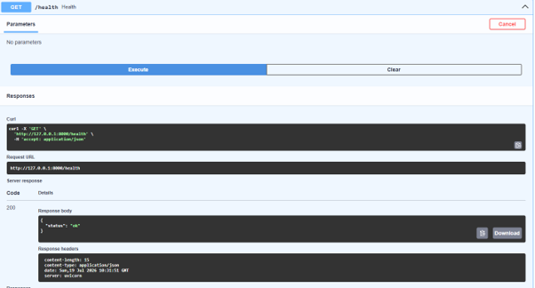

# fastapi-task-api
A simple RESTful CRUD API built with FastAPI using in-memory storage. The project demonstrates Create, Read, Update, and Delete operations with request validation, proper HTTP status codes, and interactive Swagger UI documentation.

## Features

- Create a new task
- Read all tasks
- Read a task by ID
- Update an existing task
- Delete a task
- Input validation using Pydantic
- Proper HTTP status codes
- Interactive Swagger UI documentation
- In-memory data storage (no database)

---

## Technologies Used

- Python 3.x
- FastAPI
- Uvicorn
- Pydantic

---

## Project Structure

```text
fastapi-task-api/
│
├── screenshots/
│   └── swagger-ui.png
│
├── main.py
├── requirements.txt
├── README.md
└── .gitignore
```

---

## Installation

Clone the repository

```bash
git clone https://github.com/zia0001/fastapi-task-api.git
```

Move into the project directory

```bash
cd fastapi-task-api
```

Create a virtual environment

```bash
python -m venv venv
```

Activate the virtual environment

### Windows

```bash
venv\Scripts\activate
```

### Linux / macOS

```bash
source venv/bin/activate
```

Install dependencies

```bash
pip install -r requirements.txt
```

---

## Run the Project

```bash
uvicorn main:app --reload
```

The API will be available at:

```
http://127.0.0.1:8000
```

Swagger UI:

```
http://127.0.0.1:8000/docs
```

---

## API Endpoints

| Method | Endpoint | Description |
|---------|----------|-------------|
| GET | `/` | API information |
| GET | `/health` | Health check |
| GET | `/tasks` | Retrieve all tasks |
| GET | `/tasks/{task_id}` | Retrieve a task by ID |
| POST | `/tasks` | Create a new task |
| PUT | `/tasks/{task_id}` | Update an existing task |
| DELETE | `/tasks/{task_id}` | Delete a task |

---

## Example cURL Request

```bash
curl.exe -i http://127.0.0.1:8000/tasks
```

Example Response

```http
HTTP/1.1 200 OK
content-type: application/json

[
  {
    "id": 3,
    "title": "Internship at flyrank ai",
    "done": false
  },
  {
    "id": 4,
    "title": "developing backend ai skills",
    "done": true
  },
  
]
```

---

## HTTP Status Codes

| Status Code | Meaning |
|-------------|---------|
| 200 | Successful request |
| 201 | Resource created |
| 204 | Resource deleted successfully |
| 400 | Invalid request |
| 404 | Resource not found |

---

## Swagger UI

Interactive API documentation is available at:

```
http://127.0.0.1:8000/docs
```

### Screenshot



---

## Notes

- Data is stored in memory.
- Restarting the server resets all tasks.
- No database is used in this project.

---

## Author

**Zia Uddin**

GitHub: https://github.com/zia0001
