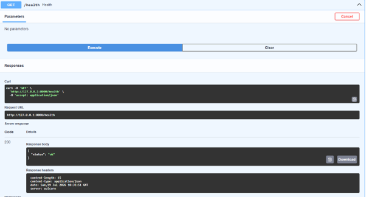
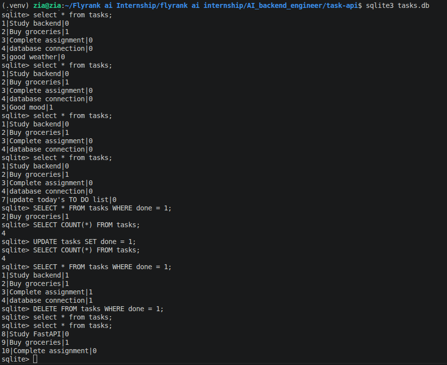

# fastapi-task-api

A simple RESTful CRUD API built with FastAPI and SQLite. The project demonstrates Create, Read, Update, and Delete operations with request validation, proper HTTP status codes, interactive Swagger UI documentation, and persistent database storage.

## Features

* Create a new task
* Read all tasks
* Read a task by ID
* Update an existing task
* Delete a task
* Input validation using Pydantic
* Proper HTTP status codes
* Interactive Swagger UI documentation
* SQLite database persistence
* Automatic database and table creation
* Automatic seeding of example tasks when the database is empty
* Data survives server restarts

---

## Technologies Used

* Python 3.x
* FastAPI
* Uvicorn
* Pydantic
* SQLite
* Python `sqlite3`

---

## Project Structure

```text
fastapi-task-api/

│
├── screenshots/
│   ├── swagger-ui.png
│   └── database.png
│
├── main.py
├── database.py
├── tasks.db
├── requirements.txt
├── README.md
└── .gitignore
```

### File Responsibilities

* `main.py` — FastAPI application, API endpoints, and request validation.
* `database.py` — SQLite database connection, table creation, seeding, and SQL operations.
* `tasks.db` — SQLite database file containing the tasks.
* `screenshots/` — Project screenshots.

---

## Database

This project uses **SQLite** for persistent data storage.

SQLite was chosen because it is lightweight, requires no separate database server, and stores the entire database in a single file. This makes it ideal for a small CRUD application and for learning how an API communicates with a real database.

The database file is:

```text
tasks.db
```

It is automatically created when the application starts if it does not already exist.

The `tasks` table contains:

| Column  | Type    | Description            |
| ------- | ------- | ---------------------- |
| `id`    | INTEGER | Primary key            |
| `title` | TEXT    | Task title             |
| `done`  | BOOLEAN | Task completion status |

If the table is empty, three example tasks are automatically inserted.

---

## Installation

Clone the repository:

```bash
git clone https://github.com/zia0001/fastapi-task-api.git
```

Move into the project directory:

```bash
cd fastapi-task-api
```

Create a virtual environment:

```bash
python -m venv venv
```

Activate the virtual environment.

### Windows

```bash
venv\Scripts\activate
```

### Linux / macOS

```bash
source venv/bin/activate
```

Install dependencies:

```bash
pip install -r requirements.txt
```

SQLite does not require a separate server installation.

---

## Run the Project

Start the FastAPI server:

```bash
python -m uvicorn main:app --reload
```

The API will be available at:

```text
http://127.0.0.1:8000
```

Swagger UI:

```text
http://127.0.0.1:8000/docs
```

On the first run, the application automatically creates:

```text
tasks.db
```

and the `tasks` table.

---

## API Endpoints

| Method | Endpoint           | Description             |
| ------ | ------------------ | ----------------------- |
| GET    | `/`                | API information         |
| GET    | `/health`          | Health check            |
| GET    | `/tasks`           | Retrieve all tasks      |
| GET    | `/tasks/{task_id}` | Retrieve a task by ID   |
| POST   | `/tasks`           | Create a new task       |
| PUT    | `/tasks/{task_id}` | Update an existing task |
| DELETE | `/tasks/{task_id}` | Delete a task           |

All CRUD operations now operate on the SQLite database rather than an in-memory Python list.

---

## Example cURL Request

Get all tasks:

```bash
curl -i http://127.0.0.1:8000/tasks
```

Example response:

```json
[
  {
    "id": 1,
    "title": "Study Python",
    "done": false
  },
  {
    "id": 2,
    "title": "Buy groceries",
    "done": true
  }
]
```

---

## SQL Example

The database can also be accessed directly using the SQLite command-line tool.

Open the database:

```bash
sqlite3 tasks.db
```

View all tasks:

```sql
SELECT * FROM tasks;
```

Example:

```text
id  title                  done
--  ---------------------  ----
1   Study Python           0
2   Buy groceries          1
```

SQLite represents Boolean values as:

```text
0 = False
1 = True
```

Other SQL queries explored during the assignment include:

```sql
SELECT * FROM tasks WHERE done = 1;
```

```sql
SELECT COUNT(*) FROM tasks;
```

```sql
UPDATE tasks SET done = 1;
```

```sql
DELETE FROM tasks WHERE done = 1;
```

---

## HTTP Status Codes

| Status Code | Meaning                       |
| ----------- | ----------------------------- |
| 200         | Successful request            |
| 201         | Resource created              |
| 204         | Resource deleted successfully |
| 400         | Invalid request               |
| 404         | Resource not found            |

---

## Swagger UI

Interactive API documentation is available at:

```text
http://127.0.0.1:8000/docs
```

### Screenshot



---

## Database Viewer

The SQLite database was also inspected using a SQLite database viewer.

### Screenshot



---

## Persistence

Unlike the original in-memory implementation, tasks are now stored in SQLite.

This means:

```text
Server restart
      ↓
tasks.db remains
      ↓
Tasks remain available
```

The database and `tasks` table are automatically created if they do not exist.

---

## Architecture

The application separates the API layer from the database layer:

```text
Client
  ↓
FastAPI
  ↓
main.py
  ↓
database.py
  ↓
SQLite
  ↓
tasks.db
```

The API endpoints remain the same while the underlying storage implementation has changed from an in-memory Python list to a persistent SQLite database.

---

## Author

**Zia Uddin**

GitHub: https://github.com/zia0001
