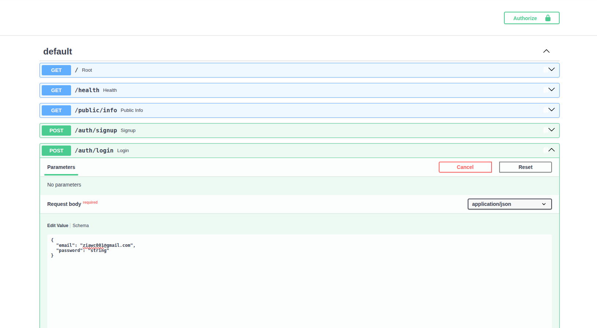
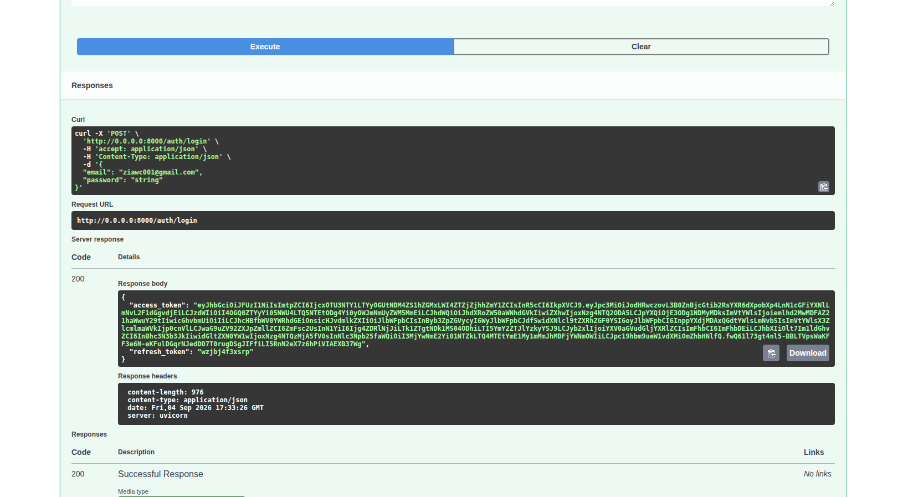

# fastapi-task-api

A RESTful CRUD API built with FastAPI, PostgreSQL, and Docker — now extended with Supabase-backed authentication. The project demonstrates Create, Read, Update, and Delete operations with request validation, proper HTTP status codes, interactive Swagger UI documentation, persistent database storage, a containerized application stack, and secure user authentication with JWT verification.

## Features

* Create a new task
* Read all tasks
* Read a task by ID
* Update an existing task
* Delete a task
* Input validation using Pydantic
* Proper HTTP status codes
* Interactive Swagger UI documentation with Bearer auth support
* PostgreSQL database persistence
* PostgreSQL running in Docker
* Persistent Docker volume for database data
* Automatic database and table creation
* Automatic seeding of example tasks when the database is empty
* Application and database start together with Docker Compose
* Data survives application and container restarts
* User sign up, log in, and log out via Supabase Auth
* JWT access token verification on protected routes
* Reusable authentication dependency applied across multiple routes
* Public and protected route separation

---

## Technologies Used

* Python 3.x
* FastAPI
* Uvicorn
* Pydantic
* PostgreSQL
* Psycopg
* Docker
* Docker Compose
* Supabase Auth (Identity Provider)
* Supabase Python SDK

---

## Project Structure

fastapi-task-api/

├── screenshots/
│   ├── swagger-ui.png
│   ├── database.png
│   └── swagger-auth.png
│
├── main.py
├── database.py
├── auth.py
├── supabase_client.py
├── init.sql
├── Dockerfile
├── docker-compose.yml
├── .dockerignore
├── .env.example
├── requirements.txt
├── README.md
└── .gitignore

### File Responsibilities

* `main.py` — FastAPI application, API endpoints (tasks + auth), and request validation.
* `database.py` — PostgreSQL connection, table creation, seeding, and SQL CRUD operations.
* `auth.py` — Pydantic request model used for signup/login (`AuthRequest`).
* `supabase_client.py` — Initializes the Supabase client from environment variables.
* `init.sql` — SQL script used to create the `tasks` table.
* `Dockerfile` — Builds the Docker image for the FastAPI application.
* `docker-compose.yml` — Runs the FastAPI application and PostgreSQL database together.
* `.env` — Local database and Supabase configuration. This file is not committed to Git.
* `.env.example` — Example environment configuration for other developers.
* `screenshots/` — Project screenshots.

---

## Database

This project uses **PostgreSQL** for persistent task storage.

PostgreSQL runs inside a Docker container and uses a Docker volume so that database data survives container restarts.

The database configuration is provided through environment variables:

POSTGRES_DB=taskdb
POSTGRES_USER=taskuser
POSTGRES_PASSWORD=taskpassword
POSTGRES_HOST=postgres
POSTGRES_PORT=5432

The actual `.env` file is gitignored and is not committed to the repository.

A `.env.example` file is included so the required configuration can be recreated.

### Tasks Table

The `tasks` table contains:

| Column  | Type    | Description            |
| ------- | ------- | ---------------------- |
| `id`    | INTEGER | Primary key            |
| `title` | TEXT    | Task title             |
| `done`  | BOOLEAN | Task completion status |

The table is created with:

CREATE TABLE IF NOT EXISTS tasks (
    id SERIAL PRIMARY KEY,
    title TEXT NOT NULL,
    done BOOLEAN NOT NULL DEFAULT FALSE
);

If the table is empty, three example tasks are automatically inserted.

---

## Authentication

User accounts, password hashing, and JWT signing are handled entirely by **Supabase Auth** — this project never stores or hashes a password itself. The backend's job is to forward credentials to Supabase and verify the JWTs it issues.

### How it works

1. A client sends credentials (email + password) to `/auth/signup` or `/auth/login`.
2. Supabase validates the credentials and returns a JWT **access token** (short-lived, ~1 hour) and a **refresh token** (used to obtain a new access token without logging in again).
3. The client attaches the access token to subsequent requests as `Authorization: Bearer <token>`.
4. Protected routes verify the token against Supabase (`supabase.auth.get_user(token)`) before allowing access.

### Reusable auth dependency

Token extraction and verification are implemented once, in a single `get_current_user` dependency, and applied to every protected route via FastAPI's `Depends()`. This means:

* No auth logic is duplicated across routes.
* Any route can be protected by simply adding `user = Depends(get_current_user)` to its signature.
* A missing or invalid token is rejected before the route's own logic runs.

### Environment variables required

SUPABASE_URL=your_supabase_project_url
SUPABASE_PUBLISHABLE_KEY=your_supabase_anon_key

The **anon key** is used — never the `service_role` key, which bypasses all security and must stay server-side only in privileged contexts.

---

## Architecture

The application separates the API layer, the database layer, and the authentication layer:

Client
   ↓
FastAPI
   ↓
main.py  ──────────────┐
   ↓                    ↓
database.py      supabase_client.py
   ↓                    ↓
PostgreSQL          Supabase Auth
   ↓
Docker Volume

Task CRUD operations are handled by the PostgreSQL repository layer. Authentication (signup, login, logout, and token verification) is handled by Supabase Auth via the Supabase Python SDK. The two concerns are independent — task routes are unaffected by the auth layer, and auth routes do not touch the tasks table.

---

## Installation

Clone the repository:

git clone https://github.com/zia0001/fastapi-task-api.git

Move into the project directory:

cd fastapi-task-api

### Create a Virtual Environment

python -m venv .venv

Activate the virtual environment.

### Linux / macOS

source .venv/bin/activate

### Windows

.venv\Scripts\activate

Install the Python dependencies:

pip install -r requirements.txt

---

## Environment Configuration

Create a local `.env` file:

POSTGRES_DB=taskdb
POSTGRES_USER=taskuser
POSTGRES_PASSWORD=taskpassword
POSTGRES_HOST=localhost
POSTGRES_PORT=5433

SUPABASE_URL=your_supabase_project_url
SUPABASE_PUBLISHABLE_KEY=your_supabase_anon_key

The `.env` file is intentionally excluded from Git. A `.env.example` file with placeholder values is committed instead — see that file for the exact keys required.

For Docker Compose, the application container uses:

POSTGRES_HOST=postgres
POSTGRES_PORT=5432

because the FastAPI container communicates with PostgreSQL through the Docker Compose network.

### Supabase project setup

1. Create a free project at [supabase.com](https://supabase.com).
2. Under **Project Settings → API**, copy the **Project URL** and **anon key** into `.env`.
3. Under **Authentication → Sign In / Providers → Email**, turn off **Confirm email** for local development, so a freshly signed-up user can log in immediately without clicking a confirmation link.

---

## Run the Project with Docker Compose

Make sure Docker is installed and running.

Build and start the complete stack:

docker compose up --build

This starts:

FastAPI application
       +
PostgreSQL database

The API will be available at:

http://127.0.0.1:8000

Swagger UI:

http://127.0.0.1:8000/docs

---

## Docker Services

The Docker Compose stack contains two services:

app
 │
 └── FastAPI application

postgres
 │
 └── PostgreSQL database
       │
       └── task-api-postgres-data

The PostgreSQL container exposes port `5433` on the host and uses port `5432` internally.

The database data is stored in the Docker volume:

task-api-postgres-data

This volume ensures that database data is not lost when the PostgreSQL container is restarted.

---

## API Endpoints

### Task endpoints

| Method | Endpoint           | Description              | Auth required |
| ------ | ------------------ | ------------------------ | -------------- |
| GET    | `/`                | API information          | No |
| GET    | `/health`          | Health check              | No |
| GET    | `/tasks`           | Retrieve all tasks        | No |
| GET    | `/tasks/{task_id}` | Retrieve a task by ID     | No |
| POST   | `/tasks`           | Create a new task         | No |
| PUT    | `/tasks/{task_id}` | Update an existing task   | No |
| DELETE | `/tasks/{task_id}` | Delete a task             | No |

### Auth endpoints

| Method | Endpoint              | Description                          | Auth required |
| ------ | --------------------- | ------------------------------------- | -------------- |
| POST   | `/auth/signup`        | Create a new user account             | No |
| POST   | `/auth/login`         | Authenticate and return a JWT         | No |
| POST   | `/auth/logout`        | End the user's session                | Yes (Bearer token) |
| GET    | `/public/info`        | Read public, open data                | No |
| GET    | `/protected/profile`  | Read private profile data (verified user) | Yes (Bearer token) |
| GET    | `/protected/dashboard`| Second protected route, reuses the same auth dependency | Yes (Bearer token) |

All task CRUD operations run against PostgreSQL. All auth operations run against Supabase Auth.

---

## Example cURL Requests

### Get all tasks

curl -i http://127.0.0.1:8000/tasks

Example response:

[
  {
    "id": 1,
    "title": "Study FastAPI",
    "done": false
  },
  {
    "id": 2,
    "title": "Buy groceries",
    "done": true
  },
  {
    "id": 3,
    "title": "Complete assignment",
    "done": false
  }
]

### Sign up

curl -i -X POST http://127.0.0.1:8000/auth/signup \
  -H "Content-Type: application/json" \
  -d '{"email":"test@example.com","password":"password123"}'

Returns `201` with the created user object.

### Log in

curl -i -X POST http://127.0.0.1:8000/auth/login \
  -H "Content-Type: application/json" \
  -d '{"email":"test@example.com","password":"password123"}'

Returns `200` with an `access_token` and `refresh_token`.

### Access a protected route

curl -i http://127.0.0.1:8000/protected/profile \
  -H "Authorization: Bearer <ACCESS_TOKEN>"

Returns `200` with the verified user's `id`, `email`, and `created_at` when the token is valid, or `401` when it is missing, malformed, expired, or tampered with.

### Log out

curl -i -X POST http://127.0.0.1:8000/auth/logout \
  -H "Authorization: Bearer <ACCESS_TOKEN>"

Returns `204 No Content`.

---

## PostgreSQL Database Inspection

The PostgreSQL database can be accessed directly through `psql`.

For example:

docker exec -it task-api-postgres-1 psql -U taskuser -d taskdb

View the available tables:

\dt

Inspect the `tasks` table:

\d tasks

View all tasks:

SELECT * FROM tasks;

Example:

 id |        title        | done
----+---------------------+------
  1 | Study FastAPI       | f
  2 | Buy groceries       | t
  3 | Complete assignment | f

---

## HTTP Status Codes

| Status Code | Meaning                                              |
| ----------- | ----------------------------------------------------- |
| 200         | Successful request                                     |
| 201         | Resource created (task, or new user on signup)        |
| 204         | Resource deleted successfully / logout successful     |
| 400         | Invalid request (missing/empty required fields)       |
| 401         | Missing, malformed, invalid, or expired access token   |
| 404         | Resource not found                                     |

---

## Swagger UI

Interactive API documentation, including the Bearer auth **Authorize** flow, is available at:

http://127.0.0.1:8000/docs

Protected routes display a lock icon. Clicking **Authorize** and pasting a valid access token allows every subsequent **Try it out** request to run as an authenticated user directly from the browser — no `curl` required.

### Screenshots

---

## Database Screenshot

The PostgreSQL database and `tasks` table were inspected directly using `psql`.

---

## Persistence Test

Database persistence was tested by creating tasks and then restarting the application and PostgreSQL container.

The process was:

Create tasks
     ↓
Tasks stored in PostgreSQL
     ↓
Stop containers
     ↓
Start containers again
     ↓
PostgreSQL uses existing Docker volume
     ↓
Tasks are still available

The PostgreSQL container reported:

PostgreSQL Database directory appears to contain a database;
Skipping initialization

after restarting, confirming that the existing database data was preserved.

The Docker volume used for persistence is:

task-api-postgres-data

The volume remains separate from the application container, allowing database data to survive container restarts.

---

## Docker Compose

The complete application stack can be started with one command:

docker compose up

For a fresh image build:

docker compose up --build

To stop the stack:

docker compose down

The Docker volume is intentionally preserved when using:

docker compose down

Therefore, the PostgreSQL data remains available when the stack is started again.

---

## Project Progression

This project has grown stage by stage across assignments:

A2

FastAPI
   ↓
In-memory / local storage

        ↓

A3

FastAPI
   ↓
PostgreSQL Repository
   ↓
PostgreSQL
   ↓
Docker
   ↓
Persistent Docker Volume

        ↓

A4

FastAPI + PostgreSQL (unchanged)
   ↓
Supabase Auth added
   ↓
Signup / Login / Logout
   ↓
JWT verification via reusable dependency
   ↓
Protected + public routes
   ↓
Swagger UI Bearer auth

Task routes and their PostgreSQL storage were left untouched while the authentication layer was added on top — proving that a new cross-cutting concern (auth) can be introduced without altering existing functionality.

---

## Author

**Zia Uddin**